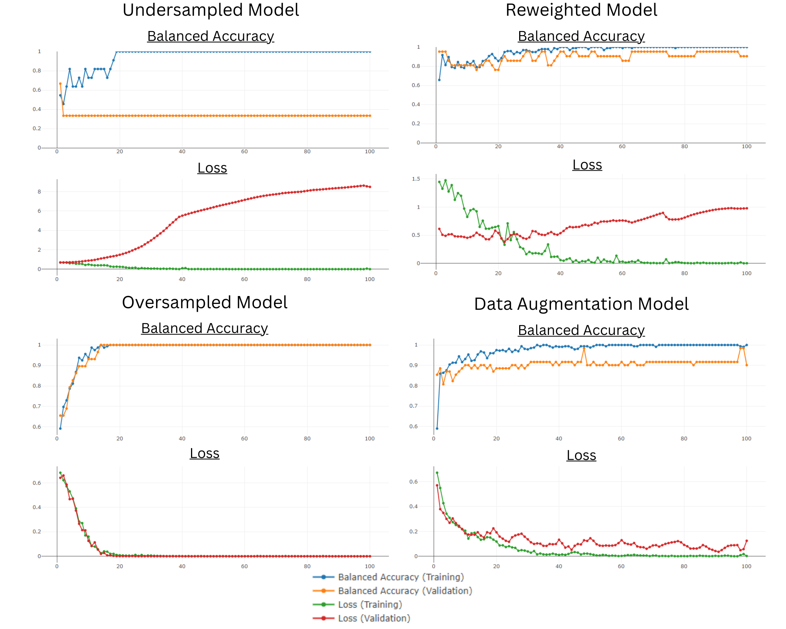

# Mouse Brain Cell Exploration & Classification

We are exploring the [Xenium Mouse Brain Cell](https://www.10xgenomics.com/products/xenium-in-situ/mouse-brain-dataset-explorer) dataset. The brain cell images are classified into different cell types using a machine learning algorithm. We explore the difference in predictions based on how differently balanced classes compare with each other in the accuracy of the prediction.
We use 3 pairs of cell types:
- Balanced Pair: Class 8 (44 images) & Class 10 (45 images)
- Moderately Unbalanced Pair: Class 14 (42 images) & Class 15 (23 images)
- Highly Unbalanced Pair: Class 1 (94 images) & Class 27 (7 images)

We observe the predictions by comparing:
- the original 3 pairs
- the 3 pairs balanced using oversampling
- the 3 pairs balanced using undersampling
- the 3 pairs balanced using augmented images
- the 3 pairs balanced using weighted balancing

The results from this exploration can be see below.


``` r
library(plotly)
library(png)
```

``` r
# Load the .rds files
unbalanced_1_27_BA_L <- readRDS("./plotly/unbalanced_1_27_BA_L.rds")
unbalanced_14_15_BA_L <- readRDS("./plotly/unbalanced_14_15_BA_L.rds")
unbalanced_8_10_BA_L <- readRDS("./plotly/unbalanced_8_10_BA_L.rds")
undersampled_balanced_1_27_BA_L <- readRDS("./plotly/undersampled_balanced_1_27_BA_L.rds")
undersampled_balanced_14_15_BA_L <- readRDS("./plotly/undersampled_balanced_14_15_BA_L.rds")
undersampled_balanced_8_10_BA_L <- readRDS("./plotly/undersampled_balanced_8_10_BA_L.rds")
oversampled_balanced_1_27_BA_L <- readRDS("./plotly/oversampled_balanced_1_27_BA_L.rds")
oversampled_balanced_14_15_BA_L <- readRDS("./plotly/oversampled_balanced_14_15_BA_L.rds")
oversampled_balanced_8_10_BA_L <- readRDS("./plotly/oversampled_balanced_8_10_BA_L.rds")
weighted_balanced_1_27_BA_L <- readRDS("./plotly/weighted_balanced_1_27_BA_L.rds")
weighted_balanced_14_15_BA_L <- readRDS("./plotly/weighted_balanced_14_15_BA_L.rds")
weighted_balanced_8_10_BA_L <- readRDS("./plotly/weighted_balanced_8_10_BA_L.rds")
aug_balanced_1_27_BA_L <- readRDS("./plotly/aug_balanced_1_27_BA_L.rds")
aug_balanced_14_15_BA_L <- readRDS("./plotly/aug_balanced_14_15_BA_L.rds")
aug_balanced_8_10_BA_L <- readRDS("./plotly/aug_balanced_8_10_BA_L.rds")

imbalance_plot <- readRDS("./plotly/imbalance_plot.rds")
```

# Executive Summary

The project report presents an in-depth analysis of the class imbalance
problem in the Xenium Mouse Brain Cell Image Dataset, a critical asset
for neuroscience researchers. The dataset, comprising over 10,000 images
of mouse brain cells distributed as follows:


*fig.1: Cluster distribution of the Xenium Mouse Brain cells dataset*

Observed, the data suffers from significant class imbalance, which
undermines the performance of predictive models, as underscored by He
and Garcia’s study in 2009, class imbalance adversely impacts machine
learning performance, necessitating the deployment of strategies like
resampling, algorithmic modifications, and ensemble methods. Our
research aims to apply these strategies to enhance predictive accuracy
in neuroscience models. The aim of the research is to scrutinize this
imbalance, explore its origins, and propose robust strategies to improve
model accuracy.

The main findings of the research include:

1.  The class imbalance in the dataset adversely impacts the performance
    of machine learning algorithms or neural network classifiers. This
    is evident in the unequal distribution of images across clusters,
    which poses significant challenges when training these models.

2.  The Convolutional Neural Network (CNN) model used in the research,
    despite its robust architecture, struggles with class imbalance. The
    model’s performance varies significantly across different clusters,
    indicating that it is not generalizing well to new data.

3.  Various class rebalancing techniques, such as re-weight balancing,
    undersampling the majority class, and oversampling the minority
    class, were explored to address the issue. Among these, the
    duplicate oversampling method performed the best when fitted to the
    CNN model.

4.  The heatmap visualization of the confusion matrix provides strong
    evidence of the high accuracy and generalization ability of the
    clustering model. The dense diagonal line reflects the model’s
    capability to accurately predict the majority of instances, while
    the dispersed incorrect predictions highlight the inherent
    complexity of the dataset.

The practical relevance of this analysis lies in its potential to
enhance the reliability of neuroscience studies that rely on the Xenium
Mouse Brain Cell Image Dataset. By addressing the class imbalance issue,
the research empowers researchers with better predictive tools. The
findings also have broader implications for other fields dealing with
class imbalance in datasets.

# Data Description

The Xenium Mouse Brain Cell Image Dataset is a valuable resource for
researchers in the field of neuroscience. This dataset contains
high-resolution images of mouse brain cells, which can be used to study
the structure and function of these cells in detail. The dataset
consists of over 10,000 images, each with a resolution of 2048 x 2048
pixels. These images were captured using a confocal microscope, which
allows for precise imaging of cells and their components.

In addition to the high-resolution images, the Xenium Mouse Brain Cell
Image Dataset also includes metadata for each image. This metadata
includes information about the cell type, the region of the brain where
the cell was located, and the experimental conditions under which the
image was captured. This information is critical for researchers who
want to ensure that their analyses are based on reliable and relevant
data.

One of the unique features of the Xenium Mouse Brain Cell Image Dataset
is its focus on rare cell types. Many other datasets in neuroscience
research focus on more common cell types, which can limit the scope of
research questions that can be addressed. The Xenium dataset includes
images of rare cell types, which can open up new avenues for research
and discovery. Overall, the Xenium Mouse Brain Cell Image Dataset is a
valuable resource for researchers in neuroscience. Its high-resolution
images, extensive metadata, and focus on rare cell types make it a
unique and valuable addition to the field.

# Methodology

Our research adopts a systematic approach, using a Convolutional Neural
Network (CNN) as a benchmark for classifying mouse brain cell images
into clusters based on gene expressions. Performance assessments rely on
balanced accuracy and binary cross-entropy loss function.

Image preprocessing are performed where images are resized to 50x50
pixels. Using the ‘inpolygon’ function from the pracma R package, pixels
within cell boundaries are identified, and those outside are set to
zero, creating a masked image which is then resized back to 50x50.

## Convolutional Neural Network Model (CNN)

The CNN model operates as an automated image classification feature
extractor, expecting single channel images of 50x50 pixels. Composed of
two convolutional blocks each followed by a max-pooling layer and three
fully-connected layers, the model includes dropout layers to prevent
overfitting. The architecture applies filters using a 3x3 kernel and
uses rectified linear unit (ReLU) activation. The max-pooling layers
reduce spatial dimensions and dropout layers minimize overfitting by
randomly dropping neurons during training. The flattening layer reshapes
the 3D outputs into a 1D vector, processed by the fully connected layers
and softmax activation to yield class probability predictions.

## Loss Function and Performance Metric

For the binary classification analysis, we employed the binary
cross-entropy loss function, given by:

$$L(y, \hat{y}) = -\frac{1}{N} \sum\_{i=1}^{N} \[y_i \log(\hat{y}\_i) + (1 - y_i) \log(1 - \hat{y}\_i)\]$$

Where *y* is the true label, *ŷ* is the predicted probability, and *N*
is the instance count.

The metric ‘balanced_accuracy’ is computed as the average of sensitivity
and specificity, which are defined as follows:

For performance measurement, we used the ‘balanced_accuracy’ metric,
averaged from sensitivity and specificity. This metric is especially
significant in assessing model performance on imbalanced datasets by
equally considering both false positives and negatives.

During model training, the ‘fit’ function in Keras returns
epoch-specific loss function and balanced accuracy values for training
and validation datasets, facilitating monitoring of potential
overfitting and underfitting.

Moreover, the evaluation of rebalancing strategies includes not only
balanced accuracy values but also their trends. While absolute loss
value comparisons may be misleading due to variable data distributions
among clusters, analyzing loss trends across epochs provides a more
nuanced understanding of the model’s learning process.

## Initial Analysis

The CNN model’s performance was evaluated on less imbalanced (8 & 10),
moderately imbalanced (14 & 15), and highly imbalanced (1 & 27) cluster
pairs. The model generally exhibited overfitting behaviour and
performance varied depending on the level of imbalance in the dataset.

### Unbalanced Plots

#### 2a. Balanced Clusters


*fig.2a: Unbalanced data plots of Clusters 8 and 10*

#### 2b. Moderately Imbalanced Clusters


*fig.2b: Unbalanced data plots of Clusters 14 and 15*

#### 2c. Highly Imbalanced Clusters


*fig.2c: Unbalanced data plots of Clusters 1 and 27*

### 

Figure 2a illustrates the training process of a CNN on a less imbalanced
cluster pair (8 & 10) with 44 and 45 cell images. The balanced accuracy
gradually increased from 0.67 to 1 after 50 epochs. Validation accuracy
improved after 10 epochs, reaching a balanced accuracy of 0.4. The
bottom fluctuation threshold increased from 0.11 to 0.17 after 60
epochs, indicating model learning despite not achieving high validation
accuracy.

In Figure 2b, the moderately imbalanced cluster pair (14 & 15) with 42
and 23 images showed slower improvement. Validation accuracy started
improving after 20 rounds, reaching a stable balanced accuracy of 0.15.
Training validation accuracy initially increased from 0.5 to 0.8 but
stagnated, indicating less efficient model learning.

In Figure 2c, the highly imbalanced cluster pair (1 & 27) with 94 and 7
images showed that the CNN model was able to classify the cell images
effectively. It achieved an initial validation balanced accuracy of
0.95, but it stagnated and then decreased as more epochs passed,
indicating overfitting. The model’s ability to easily distinguish
between the images in this cluster pair might be attributed to the
significant disparity in cluster numbers between 1 and 27, reflecting
differences in gene expression. This suggests that the cells in these
two clusters are easily discernible based on their physical features.

In all three cluster pairs, training loss decreased significantly,
indicating model improvement on the training set. However, validation
loss increased, indicating poor performance on unseen data and lack of
generalization.

These learning curve issues are attributed to dataset imbalance, where
the model tends to favor the majority class. To address these issues,
class rebalancing techniques like re-weighting, undersampling the
majority class, and oversampling the minority class can be employed.

## Re-Balancing Workflow

<figure>

<figcaption aria-hidden="true"><em>fig.3: Strategies to mitigate Class
Imbalance</em></figcaption>
</figure>

The workflow, outlined in Figure 3, evaluated the efficacy of various
re-balancing strategies across paired clusters. By identifying majority
and minority classes, applying appropriate re-balancing methods, and
reshuffling samples prior to an 80/20 training-validation split, we
promoted equal class distribution during training. This dataset was then
fed into a CNN model, with performance metrics and loss function used to
evaluate strategy effectiveness.

### Influence Reweighted Balancing

The first strategy was influence reweighted balancing, attributing
weights to clusters according to size, thereby increasing the penalty
for incorrect minority classification. The formula used:

$$w\_{\text{class}} = \frac{n\_{\text{majority}} + n\_{\text{minority}}}{n\_{\text{classes}} \cdot n\_{\text{majority or minority}}}$$

Where *w*<sub>*c**l**a**s**s*</sub> is the class weight,
*n*<sub>*m**a**j**o**r**i**t**y*</sub> and
*n*<sub>*m**i**n**o**r**i**t**y*</sub> are instances in the respective
classes, *n*<sub>*c**l**a**s**s**e**s*</sub> is total class count, and
*n*<sub>*m**a**j**o**r**i**t**y* *o**r* *m**i**n**o**r**i**t**y*</sub>
refers to instances in the class under current weight calculation. This
inversely balances class proportions, favoring the minority class.
Reshuffling is vital in this strategy to avoid potential imbalances in
training data.

### Undersampling

In this approach, random samples from the majority class were removed
with replacement to match the minority class size.

### Oversampling

Oversampling counterbalances the majority class by synthesizing
additional minority class instances. Two methods were employed:

#### Oversampling by Duplication

Duplicates of minority class instances were randomly created with
replacement to reach majority class levels.

#### Oversampling by Augmentation

For a more varied dataset, 16 augmented versions of each minority
instance were produced through rotation, shifting, shearing, zooming,
and horizontal flipping (refer to Appendix A.i). From these, random
instances were selected to match majority class counts, thereby
enhancing the model’s generalizability.

# Results

We will now evaluate how each of the re-balancing performed impact the
model performance in the 3 cluster pairs with varying degree of
imbalance.

## 

### 4a. Balanced Clusters

<figure>

<figcaption aria-hidden="true"><em>fig.4a: Balancing Strategies for
Clusters 8 and 10</em></figcaption>
</figure>

Figure 4a assesses the impact of re-balancing techniques on balanced
clusters (8 & 10). Each technique enhances the validation balanced
accuracy. The re-weighted mode elevates the overall balanced accuracy
from 0.2 to 0.4, yet presents discrepancies between training and
validation balanced accuracy, suggesting the model is overfitting.
Overfitting is also evident in the undersampling model, highlighted by a
decreasing validation balanced accuracy as the model improves on the
training data. The oversampled models (both duplicate and augmented)
outperform the others, displaying a rise in validation balanced accuracy
and lower loss function. The augmented oversampling model is especially
effective, reaching higher balanced accuracy faster and suggesting
superior model efficiency and prediction accuracy. However, all models
exhibit overfitting, revealed by decreasing training loss function and
increasing validation loss function, indicating a disparity in model
performance between training and unseen testing data.

\*select the next tab for further analysis on different cluster pairs.

### 4b. Moderately Imbalanced Clusters

<figure>

<figcaption aria-hidden="true"><em>fig.4b: Balancing Strategies for
Clusters 14 and 15</em></figcaption>
</figure>

In moderately imbalanced clusters (14 & 15) Figure 4b, re-balancing
techniques improve overall balanced accuracy. The re-weighted model
again presents overfitting (decreasing validation balanced accuracy),
and the undersampling model exhibits inconsistency in training,
accentuated by the dip in validation balanced accuracy after 60 epochs.
Oversampling methods (duplicate and augmented), on the other hand,
substantially enhance the validation balanced accuracy, stabilizing at
around 0.9. The augmented model, in particular, shows fluctuations
likely due to additional diversity in the validation set, whereas it
flatlined for the duplicated oversampling model. It’s important to note
that these results require further confirmation, given both validation
and training sets are derived from the oversampling process. To address
this, prediction balanced accuracy was calculated on the original raw
data, to better simulate real world scenarios, resulting in scores of
0.82 and 0.80 for the duplicate and augmented oversampling methods
respectively. These scores, albeit lower than the graphed validation
balanced accuracy, signify a considerable improvement over the
unbalanced model and underscore the importance of validating model
performance on unmodified raw data.

### 4c. Highly Imbalanced Clusters

<figure>

<figcaption aria-hidden="true"><em>fig.4c: Balancing Strategies for
Clusters 1 and 27</em></figcaption>
</figure>

The efficacy of re-balancing techniques on highly imbalanced clusters (1
& 27) is assessed in Figure 4c.

Among all techniques, the undersampled model performed the poorest,
falling behind even the unbalanced model. This result stems from a
significant loss of data in the majority cluster (1), which went from 94
images to just 7, severely impacting the model’s validation accuracy.

Contrastingly, the re-weighted model exhibits decent performance at
first glance. However, a detailed inspection reveals a lower validation
accuracy compared to the unbalanced model. Upon validation on the entire
combined dataset, the balanced accuracy was only 0.56, with 57% of the
majority class samples misclassified into the minority class, suggesting
overfitting to the minority class.

In contrast, the oversampled models show the least overfitting signs,
with the validation and training loss functions decreasing
simultaneously. Despite this, the augmented model struggles to maintain
a consistent zero validation loss function, hinting at mild overfitting.

The duplicate oversampling model, however, demonstrates flawless
classification in each cluster, indicating superior performance. This
was further confirmed by deploying the trained models to predict the
combined cluster images, where the duplicate oversampling model achieved
a balanced accuracy of 1. But surprisingly, the augmented model yielded
a significantly lower balanced accuracy (0.59), suggesting overfitting
to the majority class.

## Results Summary and Further Implementation

From the analysis of cluster pairs, the duplicate oversampling
technique, when applied to our CNN model, outperformed all other
methods. In light of this, we extend its application to the entire
dataset to assess its wider performance.

Clusters with less than 40 samples were designated as minority classes
and oversampled. To avoid over-representation, if the total image count
(original + duplicated) exceeded 45, a random selection of 45 images was
made. The oversampled clusters were merged with the majority class,
shuffled to maintain unbiased learning while preserving their respective
labels.

This process negates potential bias during training, where the ordered
dataset may result in skewed learning towards one class at a time.
Shuffling ensures a mixed representation of classes during training,
thus promoting balanced learning. It allows each training batch to
capture a broader sample of the data’s distribution, facilitating the
learning of generalized features and mitigating overemphasis on
non-representative sequences.

Notably, the shuffling was applied post-oversampling to prevent the
clumping of duplicated images in the training set, facilitating balanced
class representation. However, it was not extended to the final test
data to preserve an unbiased, representative evaluation sample.80/20
validation split were then applied to this shuffled set, to prevent
overfitting elspecially with duplicate oversampling, the model may
overfit to the data it has seen. The model would then perform well on
the training data but poorly on unseen data. By setting aside a portion
of the data for validation and testing, you can get a better sense of
how well the model generalizes to new data.

### Model Evaluation and Heatmap Analysis

Performance evaluation of the all-clusters model was conducted using the
original, unbalanced dataset, substituting it for prediction and
assessing the resulting confusion matrix via a heatmap.


The heatmap visualizes the classification results, allowing us to
identify patterns, misclassifications, and gain insights into the
model’s accuracy. The diagonal line on the heatmap represents instances
of accurate predictions, indicating the model’s success in capturing the
dataset’s underlying structure.

Despite the dense diagonal line demonstrating the model’s proficiency,
off-diagonal cells reflect misclassifications. Notably, these errors
were not concentrated, suggesting the absence of systematic errors or
bias towards specific clusters. The dispersion of incorrect predictions
signals the model’s diverse errors, rather than consistent
misclassifications of certain data points.

The heatmap substantiates the high accuracy and generalization ability
of our model. It reinforces the efficacy of our approach in capturing
the patterns and structures inherent in the dataset, despite its
complexity. The misclassifications, however, underline the inherent
complexity and the challenges associated with perfect classification.

In addition, the multi-class balanced accuracy of 0.89, while indicative
of a highly effective model, also points to the room for further
improvement in handling the complexity and potential intricacies present
within our data.

#Application

## Shiny App

### Prediction

<figure>

<figcaption aria-hidden="true"><em>fig.5a: Screenshot of Shiny App
(predictions)</em></figcaption>
</figure>

Following our analysis, a model was trained on all 28 clusters from the
Mouse Brain Cell dataset, which included the oversampling of minority
clusters as described in the ‘Results Summary and Further
Implementation’ section.

The model was deployed in an interactive Shiny app, designed for use by
researchers and scientists. Users can upload an image file from the raw
dataset, and the model will predict the corresponding cluster. The app’s
key feature is its interactivity, allowing users to directly engage with
the model’s predictive capabilities. Despite its complex functions, the
app’s minimalistic design ensures ease of use, facilitating a
comprehensive understanding of our model’s performance. The app can be
reviewed on [Predictive Shiny
App](https://kudos.shinyapps.io/shiny_app_prediction/)

### Plots

<figure>

<figcaption aria-hidden="true"><em>fig.5b: Screenshot of Shiny App
(plots)</em></figcaption>
</figure>

The initial Shiny app effectively conveyed the outcomes of our research,
this next application delves into our methodological approach. It allows
interactive exploration of graphs illustrating class imbalance and its
impact on model performance.

Users can select cluster pairs and balancing strategies to study
in-depth. Each graph is accompanied by a succinct explanation, geared
towards users with technical expertise. The key metrics presented are
model loss and balanced accuracy.

The app’s defining feature is its interactive nature, enabling a
hands-on understanding of different rebalancing strategies and their
outcomes. It serves as a tool to facilitate comparisons and
comprehension of the results.

The app can be reviewed on [Shiny App
Plots](https://kudos.shinyapps.io/shiny_app_plots/)

# Conclusion

Our study examined the class imbalance in the Xenium Mouse Brain Cell
dataset and evaluated strategies for optimizing a CNN model for cell
cluster classification. Among the tested approaches, duplicate
oversampling proved to be an effective strategy in managing class
imbalance and enhancing model performance.

## Limitations

Despite encouraging results, limitations exist. Our model is
specifically tailored to the Xenium Mouse Brain Cell dataset, limiting
its generalizability to other datasets. Additionally, our reliance on a
single test set for model evaluation calls for more comprehensive
testing techniques such as k-fold cross-validation to assess the model’s
reliability.

## Future Research & Improvements

Future work could focus on examining multiple rebalancing techniques to
address class imbalance more effectively. Exploring alternative models
beyond CNNs for cell cluster classification, such as Random Forests,
Support Vector Machines, or deep learning architectures like
Transformers, could also yield more potent outcomes.

In summary, our research underscored the impact of class imbalance on
cell cluster classification and validated the effectiveness of duplicate
oversampling. However, acknowledging our limitations regarding dataset
specificity and testing methods, further research can refine rebalancing
techniques and explore alternative models, potentially leading to
advancements in cell cluster classification.

# Contribution

Qikun executed the oversampling of minority classes and debugged
associated codes. Yiheng contributed to the undersampling of majority
classes. Leo contributed to the class weightage adjustments. Jipeng
initiated the data augmentation technique, followed by contribution to
image augmentation. Jeremy contributed to code debugging the previous
models, all cluster model development, report writing, and presentation.
Kunal built the Shiny app, maintained the GitHub repository, and
participated in report composition and presentation. The distribution of
these tasks provided a comprehensive overview of the project’s
management, as seen in Appendix A.ii, representing individual
contributions on GitHub.

# Appendix

## A.i Augmented Oversampling

<figure>

<figcaption aria-hidden="true"><em>Image Augmentation</em></figcaption>
</figure>

# References

1.  He, H., & Garcia, E. A. (2009). Learning from imbalanced data. IEEE
    Transactions on Knowledge and Data Engineering, 21(9), 1263-1284.
    DOI:
    [**10.1109/TKDE.2008.239**](https://doi.org/10.1109/TKDE.2008.239)  
2.  Buda, M., Maki, A., & Mazurowski, M. (2018). A systematic study of
    the class imbalance problem in convolutional neural networks. Neural
    Networks, 106, 249-259. doi:
    [**10.1016/j.neunet.2018.07.011**](10.1016/j.neunet.2018.07.011)  
3.  Image Cluster Prediction. (2023). Retrieved 28 May 2023, from
    [**kudos.shinyapps.io/shiny_app_prediction**](https://kudos.shinyapps.io/shiny_app_prediction/)  
4.  Exploring Class Imbalance in Xenium Mouse Brain Cell Images. (2023).
    Retrieved 28 May 2023, from
    [**kudos.shinyapps.io/shiny_app_plots**](https://kudos.shinyapps.io/shiny_app_plots/)
